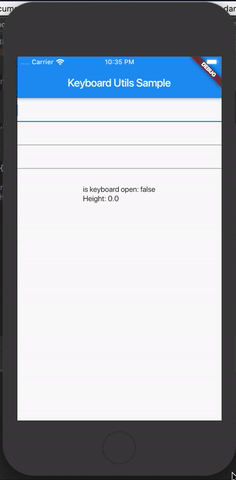

# keyboard_utils

A Flutter plugin for check the keyboard visibility.



## Install

Follow this [guide](https://pub.dev/packages/keyboard_utils/#-installing-tab-) 

## How to use

Add the imports:
```dart
import 'package:keyboard_utils/keyboard_utils.dart';
import 'package:keyboard_utils/keyboard_listener.dart';
```
Create the KeyboardUtils:
```dart
KeyboardUtils  _keyboardUtils = KeyboardUtils();
```

Attach the listener to KeyboardUtils:

```dart
_keyboardUtils.add(listener: KeyboardListener(
        willHideKeyboard: () {
          _streamController.sink.add(_keyboardUtils.keyboardHeight);
        },
        willShowKeyboard: (double keyboardHeight) {
          _streamController.sink.add(keyboardHeight);
        }
    ));
```

Check the sample for more details.
